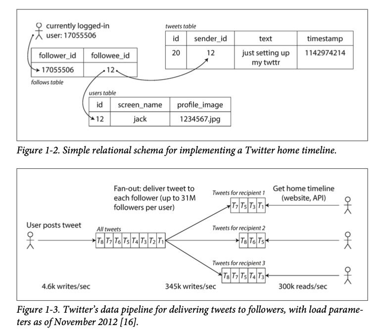
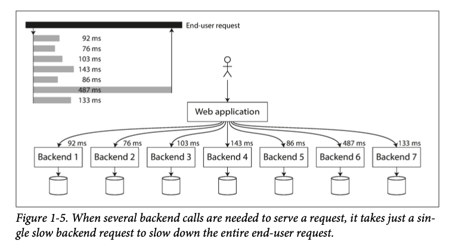

## Reliable, Scalable, and maintainable app
这一章主要介绍了这本书里面用到的概念的*定义*

What does reliability, scalability, and maintainability mean in this book? 

目前的应用分为 *data intensive* vs *compute-intensive*. compute intensive usually comes in scientific computing application (modeling, prediction etc)

但是生活中大多数的application 实际上问题更在于数据的处理、存储方面
> bigger problems are usually the amount of data, the complexity of data, and the speed at which it is changing

也就是这本书侧重的角度: Data, 这本书从数据的角度出发来介绍一个大数据应用

任何app 都离不开跟数据打交道，以下是作者概括的几点

- Store data (databases)
- remember expensive operation to speed up reads (caches)
- Search data by keyword or filter it in various ways (search indexes)
- Send message between processes (stream processing)
- Periodically process large amount of data (batch processing)


书中提到了有人用 redis 来做 message queue, 这是我第一次听说，kafka 用来做 db 我之前倒是听说过

> There are many factors that may influence the design of a data system, including the skills and experience of the people involved, legacy system dependencies, the time-scale for delivery, your organization's tolerance of different kinds of risk, regulatory constrains 

是的，一个数据系统就是会受很多不同的factor影响，这本书主要集中在3个点

- Reliability
- Scalability
- Maintainability

这三样实际上任何大型的系统都需要考虑。尤其是 maintainability, 在"年纪大的公司"上过班的人应该深有体会，里面很多软件动不动就是10几年前的，所以能够让新来的人快速上手或者理解里面的概念就很重要了

## Reliability
这里面介绍了 3 种 faults

- Hardware
- Software
- Human

*faults* is when things can go wrong. 这里作者强调了 fault tolerance 一定要定义certain types of faults，不然假如你所有服务器被黑洞吸走了，你想要tolerating this type of fault, 你需要在space 上建服务器，~~那你可能需要跟马斯克或者贝佐斯来讨论一下你的budget了…… ~~
SpaceX 或者blue origin 欢迎你!

fault is not same as failure. A fault is defined as one component of the system deviating from its spec, whereas a *failure* is when the system as a whole stops providing the required service to the user.

failure 在 service 里面的换一个词应该可以叫 outage, 就比如说一个网站上不去了这类的

### Hardware faults
虽然在平时生活中不多见，但是硬件一旦数量变多了之后损坏的概率也会越来越大 
> Hard disks are reported as having a mean time to failure about 10 to 50 years

Mean Time to Failure (MTTF) refers to the **average time it takes for a system to fail**.

$$
MTTF = \frac{Total\ Operating\ time}{Num\ of\ failures}
$$

所以如果你有一个 10,000 个 disk 组成的 storage cluster, 那么就会有 $\frac{1\ day}{10 \times 365\ days} \times 10000= 2.73972603$ disk per day to fail

如何解决这类问题？一般通过duplication/redundancy 来解决这类问题


### Software Errors
这类 bug 通常潜伏一段时间在特定情况下才会出现，比如 memory leak 一般只有在大量请求 (client 端 retry) 导致原本不会显示的bug 浮出水面，因为 pointer 没有被释放，所以大量 request 导致了 resource deplition 
如何解决这类问题呢？ 没有一个固定公式
>carefully thinking about assumptions and interactions in the system; thorough testing; process isolation; allowing processes to crash and restart; measuring, monitoring, and analyzing system behavior in production

这些都是好的方案

### Human errors
System are operated by human. A wrong config can cause company wide outage
[2021年 Facebook](https://www.facebook.com/business/news/update-about-the-october-4th-outage) 所有产品都连不上就是因为一个 command error
>This was the source of yesterday’s outage. During one of these routine maintenance jobs, a command was issued with the intention to assess the availability of global backbone capacity, which unintentionally took down all the connections in our backbone network, effectively disconnecting Facebook data centers globally.


how to avoid human errors? 
- Test thoroughly at all levels, unit test, integration test
- Easy to rollback. Rollout new code gradually
- Setup detailed and clear monitoring (这实际上已经够一个单独的书了)


## Scalability
Scalablility 就是一个系统能够适应不断增长的load 的能力

### Describing load
解决一个问题首先要把问题描述清楚
What is current load on the system? What happens if our load doubles? 
这里为了描述 load, 就需要定义 *==load parameters==*. 
The choice of *load parameters* depends on the architecture of your system. 如果是一个 web server，request per second 可能是一个好的 load parameter. 如果是一个 database, *ratio of read to write* 没准是一个好的 load parameter. 如果是聊天应用， *number of active users* 可能是一个好的 load parameter 

书里面用了 twitter 的例子 post tweet (12k request / sec at peak)
read (300k request / sec)
12k writes is not hard but fan-out is, 因为一个人可能会有很多个follower，然后这些follower 又会有其他 follower，所以write 需要cope with fanout 
> fanout means output need enough current (power) to drive all the attached input
> In transaction processing systems, we use it to describe the number of requests to *other* services that we need to make in order to service one incoming request

换句话说，fanout 是一个 service 接收到请求之后需要发多少个 request 给其他请求才能完成任务

there are 2 ways of implementing these two operations (read, write)
1. 每次新的 tweet 直接 insert 进一个 global collection of tweets. 用户检查 homeline 的时候，找到他 follow 的所有人，然后找到这些人的 tweet，最后按照 时间线 merge
```sql
SELECT tweets.*, users.* FROM tweets
	JOIN users ON tweets.sender_id = user.id
	JOIN follows ON follows.followee_id = user.id
	WHERE follows.follower_id = current_user
```
2. 对每一个用户的 home timeline 做一个 cache, 就像 email 地址一样。每当一个用户 post 一个 tweet 的时候，找到所有follow他的人，然后在他们的 home timeline 上面 insert 新的tweet。这样读取 home timeline的时间就会大大提高因为结果已经存好了



twitter (现在应该叫X了) 之前是用第一种方法，之后换到第二种方法了 (2012)
> This works better because the average rate of published tweets is almost two order of magnitude lower than the rate of home timeline reads, so in this case it's preferable to do more work at write time and less at read time

这种pattern 实际上是大多数 app的需求，无论是 youtube, 抖音，还是 Facebook，读的需求要比写的大得多

但是第二种approach 也不是没有downside，就比如如果一个人有很多的 follower，30 million，那么他发一条 tweet 就需要产生 30million writes 
>Doing this in a timely manner—Twitter tries to deliver tweets to followers within five seconds—is a significant challenge.

在 Twitter 这个例子中，distribution of followers per user (maybe weighted by how often those user tweet) is a key load parameter for discussing scalability, since it determines fanout load
Trump 其实就是一个很好的例子，他发 tweet 的频率应该比其他明星要高很多

> Your application may have very different characteristics, but you can apply similar principles to reasoning about its load

这里就是我们设计一个 app 的时候需要考虑的因素了
最后twitter是用的 hybrid approach。 具体细节在chapter 12 里面还会提到

### Describing performance
当我们设计好 load parameters 之后，我们可以开始观察系统在 load increase 之后的表现了 
- If CPU, memory, network bandwidth is unchanged, how is the performance of our system affected after load increased?
- How much do we need to increase our resources to keep performance unchanged? 

不同系统需要观察的 performance parameter 也不一样, batch processing system like Hadoop cares about *throughput* -- the number of records we can process per seconds, or the total time it takes to run a job on a dataset of certain size.
其实生活中的例子不也到处都是么，你希望网页 load 的latency (response time) 越低越好，你希望你下载东西的总时间越短越好(throughput)
> Latency and response time are often used synonymously, but they are not the same. The response time is what the client sees: besides the actual time to process the request (the service time), it includes network delays and queueing delays. Latency is the duration that a request is waiting to be handled—during which it is latent, awaiting service

Latency 是 server side parameter，不考虑 network 之间的delay 
在measure response time 的时候，我们通常take sample of distribution. There are occasional *outliers* that can take much longer. 这里就需要用到 percentile 的概念了
这张图描述得挺清晰

percentile 就是在这个 sample里面有多少 percent的值小于当前的数值
比如你有10个数，里面8个1，1个9和1个10，那么90th percentile 是9，但是50 percentile 只有1 

percentile 在衡量performance 更有效因为大多数的data 一般都很低，而我们需要看的往往只是 outlier 在哪里，换句话说，我们保证即使在最坏的情况下，我们的performance (latency) 也不会高于这个值

我们组的 SLA 就是 p99 要低于 8ms
> High percentiles become especially important in backend services that are called multiple times as part of serving a single end-user request.

对的，client 对不同的 backend service make request 的时候，就要等最后一个完成, 所以这时候 high percentiles become important


### Approaches for coping with load
定义了 load parameter and metrics for measuring performance 之后，我们就可以讨论 scalability 了
> How do we maintain good performance even when our load parameters increase by some amount? 

人们经常提到 *scale up*(增加硬件) vs *scale out* (把 load 分布到不同的机器上)
scale out 需要你的系统是 shared nothing architecture。 scale up 比较容易但是通常会很贵，而且通常一个系统的 load 大到一定程度的时候已经不可能用一台机器 handle了
现实中可能是 mixture of approaches 

>An elastic system can be useful if load is highly unpredictable, but manually scaled systems are simpler and may have fewer operational surprises (see “Rebalancing Partitions” on page 209).

后面会讲到 partition 相关的内容，因为自动增加计算/存储资源的系统需要 handle 很多 edge case

> The architecture of systems that operate at large scale is usually highly specific to the application—there is no such thing as a generic, one-size-fits-all scalable architecture (informally known as magic scaling sauce).

确实是这样

> For example, a system that is designed to handle 100,000 requests per second, each 1 kB in size, looks very different from a system that is designed for 3 requests per minute, each 2 GB in size—even though the two systems have the same data throughput.

这个例子还是挺好的，最后还是要具体例子具体分析，因为 access parttern 不一样

>An architecture that scales well for a particular application is built around assumptions of which operations will be common and which will be rare—the load parameters. If those assumptions turn out to be wrong, the engineering effort for scaling is at best wasted, and at worst counterproductive. In an early-stage startup or an unproven product it’s usually more important to be able to iterate quickly on product features than it is to scale to some hypothetical future load.

所以要先定义好产品的需求，或者说如果是 startup，后端 scale 的问题应该根据用户增长的预判来设计，保证产品的 feature 满足用户的需求才是更重要的事情
不然你花很大力气设计一个能够handle 1000万 request / sec 的系统结果只有 100/sec 那可能白费力气了

> Even though they are specific to a particular application, scalable architectures are nevertheless usually built from general-purpose building blocks, arranged in familiar patterns. In this book we discuss those building blocks and patterns.

即使每一个 app 需求不一样, scalable architectures 也是可以模块化的，这本书就讨论 building blocks and patterns

## Maintainability
>It is well known that the majority of the cost of software is not in its initial development, but in its ongoing maintenance—fixing bugs, keeping its systems operational, investigating failures, adapting it to new platforms, modifying it for new use cases, repaying technical debt, and adding new features.

在亚麻一个运行很久的service 对这句话深有体会……

> Yet, unfortunately, many people working on software systems dislike maintenance of so-called legacy systems—perhaps it involves fixing other people’s mistakes, or working with platforms that are now outdated, or systems that were forced to do things they were never intended for.

是的！！我确实经常感觉到 working on legacy system 里面的痛点！
所以在设计的时候就要把 maintainability 的因素考虑进来
书里面强调了对 maintainability 的3个要素
- Operability
- Simplicity
- Evolvability

operability 强调的是保证 operation 层面越简单越好
simplicity 保证的是能让新来的 engineer 让易上手
evolvability 是让你的系统更容易根据新的需求进行改动
### Operability: Making life easy for operations
书里面居然又 reference 到了 Jay Kreps 的文章，他的 [the log](https://engineering.linkedin.com/distributed-systems/log-what-every-software-engineer-should-know-about-real-time-datas-unifying) 那篇文章写的是真的好， 看来linkedin 系的engineer 对于 distributed system 理解还是很深刻的

operation 主要负责下面的几点
- Monitoring system health and restore service if it goes bad 
- Tracking down the cause of the problems (root cause)
- Keeping software and platforms up to date. Including security patches
- Anticipating future problems and solving them before they occur (capacity planning)
- Establishing good practices and tools for deployment, configuration management (deployment pipeline, version control, rollback mechanisms etc)
- Performing complex maintenance tasks, such as moving an application from one platform to another (这一步实际上现在大多数 app 都已经是 multi platform了)
- Defining processes that make operations predictable and help keep the production environment stable (amazon has change management (CM) and two person verification (TPV))
- Preserving the organization's knowledge about the system, even as individual people come and go (这一点亚麻有的组做的很差……)

建议把doc 也用 version control 管理起来，这样新来的人可以查看历史记录
做到上面的几点我们需要
- Providing good monitoring
- Providing good support for automation and integration with standard tools
- Avoid dependency on individual machines
- Providing good documentation and an easy to understand operational model (If I do X, Y will happen)
- Providing good default behavior 
- self-healing where appropriate (auto swap)

### Simplicity: Managing Complexity
> but as projects get larger, they often become very complex and difficult to understand.
> There are various possible symptoms of complexity: explosion of the state space, tight coupling of modules, tangled dependencies, inconsistent naming and terminology, hacks aimed at solving performance problems, special-casing to work around issues elsewhere, and many more. Much has been said on this topic already

第一遍读的时候还没接触到complex system，在亚麻工作一段时间后发现这些问题基本都"中枪"了


### Evolvability: Making change easy
新的需求总会不断出现，所以一个系统能够根据新的需求进行进化就很有必要了
比如用户想要新的功能，或者我们采用新的工具等等

>The ease with which you can modify a data system, and adapt it to changing requirements, is closely linked to its simplicity and its abstractions: simple and easy-to- understand systems are usually easier to modify than complex ones. But since this is such an important idea, we will use a different word to refer to agility on a data system level: evolvability

作者用了twitter 里面如何 "refactor" approach 1 to approach 2 的例子来表示他为什么用  *evolvability* instead of refactoring
因为当一个系统足够复杂的时候，可能用进化会更恰当一点吧…… refactor 通常也只是几个 source file 的code

## Summary
This chapter talked about *Reliability*, *Scalability* and *Maintainability*

Reliability means system can recover from faults (hardware, software, human)

Scalability means system can cope with increasing load (before that, you need to define *load parameter*)

Maintainability means making life easier for new comers, people who operate this system. And easier to add/upgrade features


